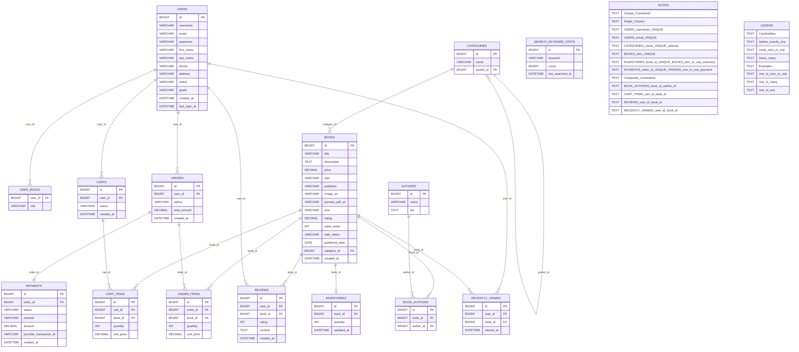

# Bookstore ERD  
  

  
## Notes  
  
- Table and column names reflect the current JPA mappings and unique constraints in the codebase.  
- Enums (roles, cart/order/payment statuses, payment method) are stored as strings.  
- Monetary fields use DECIMAL with appropriate scale per entity.
- 옵시디언에 그대로 복붙 ㄱㄱ